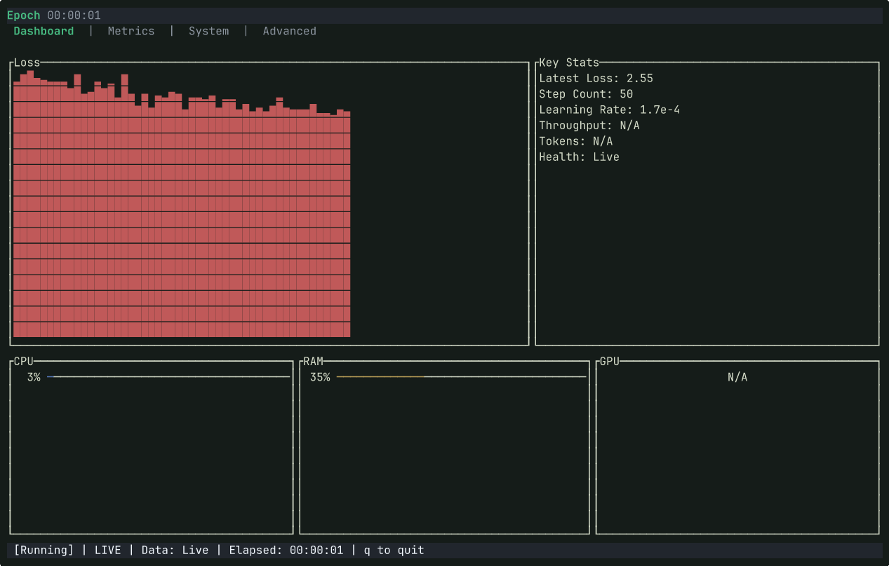

<div align="center">


<br>

[]()
[]()
[]()

<br>

</div>

**epoch** is a terminal-native telemetry console for AI/ML training workloads.

It provides **real-time observability for model training** directly in the terminal — combining **training metrics** and **hardware telemetry** into a single responsive interface.

<!-- TODO: record demo → uncomment below -->
<!-- ## Visual Proof -->
<!--  -->

## ❯ Capabilities

```
╔═════════════════════════════════════════════════════════════════════╗
║                     EPOCH TELEMETRY MATRIX                          ║
╠════════════════════════════╦════════════════════════════════════════╣
║ TRAINING METRICS           ║ HARDWARE TELEMETRY                     ║
╠════════════════════════════╬════════════════════════════════════════╣
║ Loss monitoring            ║ GPU utilization                        ║
║ Learning rate tracking     ║ VRAM usage                             ║
║ Training steps / epochs    ║ CPU load                               ║
║ Tokens / samples per sec   ║ System memory                          ║
║ Throughput visualization   ║ Optional NVML GPU support              ║
╚════════════════════════════╩════════════════════════════════════════╝
```

Additional system capabilities:

- **Multi-view TUI**
  Dashboard / Metrics / System / Advanced tabs

- **Multiple log formats**
  JSONL + CSV + HuggingFace `trainer_state.json` + custom regex patterns

- **Pipe-based streaming input**

## Protocol

### Installation

```bash
$ git clone https://github.com/grannejanne/epoch.git
$ cd epoch
$ cargo build --release
$ ./target/release/epoch
```

Optional CPU-only build:

```bash
$ cargo build --release --no-default-features
```

### Monitor a training log

```bash
$ epoch train.log
```

### Zero-config mode

```bash
$ epoch
```

With no arguments, epoch scans the current directory tree for training artifacts and starts from the newest match.

### Stream directly from a training process

```bash
$ python train.py 2>&1 | epoch --stdin
```

This allows **zero-integration monitoring** without modifying training scripts.

### Override parser

```bash
$ epoch --parser regex train.log
```

Supported parsers:

```
auto
jsonl
csv
regex
```

## Interaction

### Keyboard Controls

```
┌──────────────┬─────────────────────────┐
│ Key          │ Action                  │
├──────────────┼─────────────────────────┤
│ Tab / →      │ Next tab                │
│ Shift+Tab / ←│ Previous tab            │
│ 1 2 3 4      │ Jump to tab             │
│ Space        │ Toggle LIVE/PAUSED view │
│ Left / Right │ Pan history window      │
│ - / =        │ Zoom out / in           │
│ g            │ Return to LIVE          │
│ q / Ctrl+C   │ Quit                    │
└──────────────┴─────────────────────────┘
```

Throughput labels are source-native:

- `tokens/s` for token throughput
- `samples/s` for sample throughput
- `steps/s` for optimizer/update throughput

## Stream Formats

### Current (v0.2.0)

```
JSONL
{"loss": 0.53, "step": 120, "lr": 1e-4}
```

```
Regex
custom framework training logs
```

```
CSV
step,loss,lr
```

```
HuggingFace trainer_state.json
{"log_history": [{"loss": 0.53, "step": 120, "learning_rate": 1e-4}]}
```

### Planned

```
TensorBoard event files
```

## Configuration

Configuration file:

```
~/.config/epoch/config.toml
```

Example:

```toml
tick_rate_ms = 100
parser = "auto"
```

## Future

```
SYSTEM_DIAGNOSTICS
```

```
[ ] TensorBoard stream ingestion
[ ] Multi-run comparison
[ ] Training loss graph smoothing
[ ] HuggingFace Trainer integration
[ ] WebSocket metric streaming
```

## Deferred to v0.2.1

- Distributed training telemetry ingestion and cross-node aggregation
- Cost/carbon external API integrations
- Deep task-specific evaluation matrix ingestion

## ❯ License

MIT — see `LICENSE` for details.
